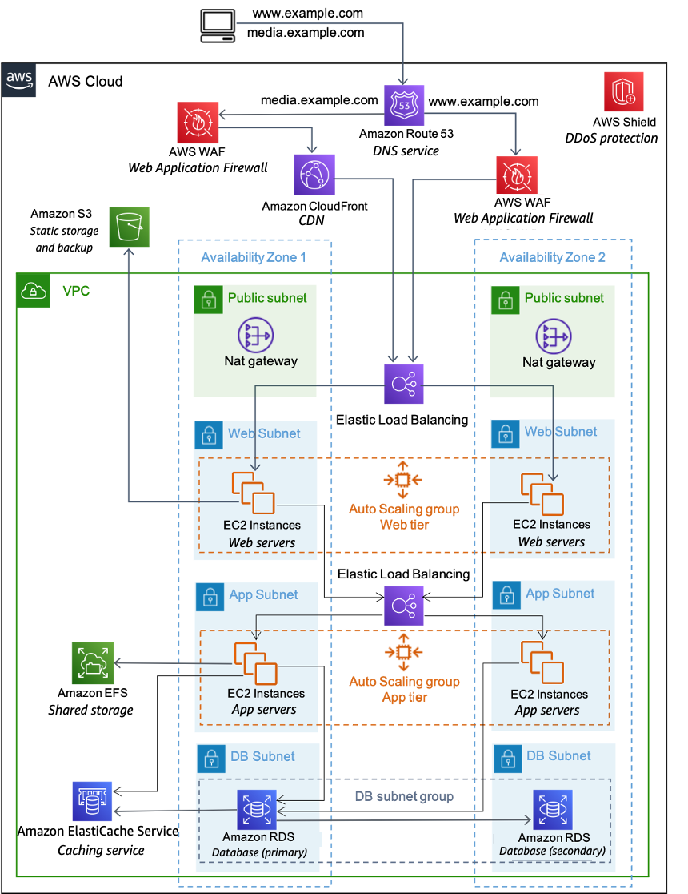

# Web and Mobile app Proposal for Leads capture By AdobeFlow

This project proposal describes full devops operations to deliver web and mobile app 
for lead capturing by AdobeFlow. 

Purpose of this document is to provide overall summery of the project deliverables and estimation.

## Project Requirement Brief 

- Phase 1 is a responsive website, Phase 2 is a mobile that is able to leverage the base technology stack
- Audiences in 10 different countries
- Multilingual support
- Lead capture
  Lead data will be sent to different systems depending on the type of lead and the country of origin, this includes Email and 3rd Party APIs
- Leads need to be stored in case of delivery failure, storage needs to be in compliance with local data privacy laws
- CMS
- Live data feed from 3rd Party System
- Web experience needs to meet basic standards:
  - WCAG2.2AA Standards
  - Google Lighthouse Accessibility/SEO/Performance Metrics
- Web Experience needs to support structured schema data and social meta data
- Anti spam and security controls
- Mobile Experience needs to leverage device and OS accessibility features
- System needs to collect log and diagnostic data and metrics and support a sensible alerting strategy

# Project scopes

## Assumptions
Based on the requirement, timeframe, and budgeting purposes we assume the following

- We assume the project is operating on a global scale and will receive high traffic from day one
- Have a budget to cover the hardware requirement mentioned in the architecture below
- The Phase 2 Mobile app requires more information and the Phase 2 mobile app is not in the scope
- The web app is responsive and has one frontend form for users to submit information and serves the mobile visitors.

## Resource requirement
- Design team (1 designer) 10 hours
- Development team (1 full stack developer) 40 hours per week. 4 week
- Server solution (AWS archetect) 20 hours per week. 2 week
- Web manager (1 project manager & client success) 5 hours a week
- Require AWS services for staging and production enviorenment

## Deliverables

We identify key deliverable features for successfully delivery this software solutions

- Network & server architecture
- Software platform & development requirement
- Deployment strategy

## Network & Server Archetecture

### Network architecture
At global network and server level we are planning to capture following data and requirements

- Audiences data for request countries and security
- Capture country of request origin and serve local language by default
- Apply network level security measures based on the request data
- Use of CDN Services to deliver content 

#### Network services used
- AWS WAF (Web Application Firewall)
- AWS CloudFront (CDN)
- AWS Shield for DDOS Protection

### Server architecture
With three autoscaling groups setup, each autoscaling group will serve one request type

- Visitors Requests
- Admin CMS Requests
- API Request

#### Server software list
> Amazon Linux 
> PHP 8.2 
> Composer 2.2 
> MySQL 8 
> Redis

### Software platform & development deliverables

Below are the tech stack we are planning to use.

- Laraval 11
- Inertia
- Vue3, VueX
- Sanctum
- Passport
- Jetstream
- tailwindcss
- Flowbite
- Google Recaptcha

#### API Authentication
> 1. API  token authentication
> 
> _3rd party systems need to send system registered username and password to token endpoint and request an access token. Afterwords 3rd party system can use the access token to retrive data from leads application API endpoints._
>
> 2. OAuth2 authentication
> 
> _As many 3rd party applications use Oauth authentication, This will allow diferent applications to connect to leads API using Oauth2 authentication._
> 
>
> **_API will support read and write to Leads application data source._**

#### Frontend data feed form
Any visitor can subscribe information using front end form. 
Once visitor submit the data, Subscribers will also have the option to delete the information from Leads application.

> **Opt-in process**
> 
> _Customers who subscribe using frontend form will receive confirmation email to validate subscription._
> 
> **Opt-Out Process**
> 
> _Customers can delete information using delete form._
> _If customer submit delete request, Customer will receive delete confirmation email._

#### Data security

> Leads will collect following data from customers
> 
> First name,  Last name,  Email,  Mobile,   
> Notes,   Referral details
> 
> _All above data will be **encrypted**_
> 
> Leads application also collect Country and Terms and Condition acceptance

#### Data validation

> Data will be validated and sanitize accordingly before saving to database 

#### Localization or Multi-language support

> By default, visitor will have the choice of selecting available language 
> 
> As Leads application operate in multiple countries, 
> application offers input local language in Notes section.

#### CMS & ACL

> 3rd party applications and admin can log in to CMS.
> 
> Admins can view, edit, delete all the leads and other Registered user
> 
> There will be two types of admin account types. 
> 
> **_Administrator_** Access control level  
> Have access to all the leads 
> Can create, edit and delete other users 
> Create, edit, delete Access Control to users 
> View API Access logs, view leads metrics 
> View API usage by users 
> View Notes written in different language using translators
> 
> **_User_** Access control level  
> Users are customers that register on Leads app  
> Have access OAuth or API authentication 
> View API Usage metrics

#### Admin panel & features
> CURD operations for Leads 
> CURD operations for Users 
> Provide API access control to data based on Country 
> API Metrics view by Country, User

#### User panel & features
> Update profile settings 
> Generate Oauth2 tokens 
> API Metrics view for User

#### Visitor data delete feature
> Visitor enter email and submit to delete 
> Visitor receive email with delete link 

### Deployment strategy

To reduce the downtime and increase the availability of the website, we recommend automating deployment and testing process.

- Deployment using Bitbucket pipelines and AWS CodeDeploy service
- Code deployment to autoscaling groups
- Automated browser and accessibility testing through BrowserStack
- Automated API testing

